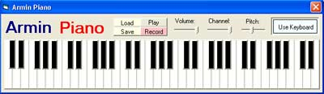



## Piano \(updated\)

### Description

This is Very Good Piano using midi

You Can control pitch , Volume , Channel

You Can use Keyboard and mouse for music

You can Record and play your music and in this update , you can Save and Load your music.
 
### More Info
 

             |
---                |---
**Submitted On**   |2006-04-05 12:07:14
**By**             |[San Arena](https://github.com/Planet-Source-Code/PSCIndex/blob/master/ByAuthor/san-arena.md)
**Level**          |Intermediate
**User Rating**    |4.2 (50 globes from 12 users)
**Compatibility**  |VB 6\.0
**Category**       |[Sound/MP3](https://github.com/Planet-Source-Code/PSCIndex/blob/master/ByCategory/sound-mp3__1-45.md)
**World**          |[Visual Basic](https://github.com/Planet-Source-Code/PSCIndex/blob/master/ByWorld/visual-basic.md)
**Archive File**   |[Piano\_\(upd1987214152006\.zip](https://github.com/Planet-Source-Code/san-arena-piano-updated__1-64928/archive/master.zip)

